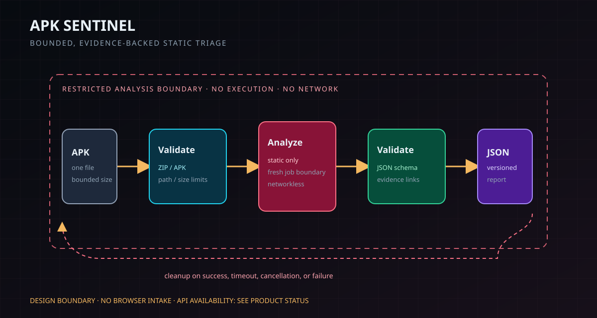

# APK Sentinel

**Willow & Birdie Innovations · Public technical showcase**

APK Sentinel is a deterministic, automation-friendly API for evidence-backed static analysis of Android APKs. This repository contains the sanitized product documentation and evidence package.

The intended workflow is bounded and deterministic: validate one APK, analyze it statically inside a restricted job boundary, return a versioned JSON report, and clean up temporary artifacts.

**Availability: unverified; published beta terms expired.** The endpoint responds to an unpaid probe, but paid analysis and renewed terms have not been reverified. Do not submit payment or private APKs. See the [canonical status](product-status.json) and [availability explanation](docs/pricing.md).

## Read a report first

The [synthetic report](examples/apk-sentinel-sanitized-report.json) shows four static API indicators. Each finding repeats its supporting indicator evidence; each scoring contribution names its finding rule. The score of 70 is a triage priority, **not a 70% probability of malware**. Check `scan_truncated` in URL and indicator sections before interpreting missing evidence.

- **Evaluate output:** [report and scoring guide](docs/report-guide.md).
- **Integrate cautiously:** [API contract and verification limits](docs/agent-api-contract.md).
- **Inspect evidence:** [validation notes](validation/apk-sentinel-validation.md).

Architecture in text: validate one bounded APK → analyze statically without network access → validate report structure and evidence references → return JSON → clean up the job. The graphic below is an illustration of this intended boundary, not a live deployment attestation.

## Validation first

The app-only static-analysis lane has completed its current internal acceptance review. A nine-sample F-Droid edge-case corpus was exercised in isolated, static-only runs; initially rejected large and complex samples were rerun after bounded-input and partial-evidence handling were improved. Successful reports were checked for repeatability and cleanup.

The [validation notes](validation/apk-sentinel-validation.md) and [real-world hard cases](docs/real-world-hard-cases.md) record what changed when real inputs exposed limits in admission policy, evidence scans, build provenance, cleanup, and concurrency. Unsupported input is not a malware verdict, and partial evidence is marked rather than presented as complete.

Traditional analysis tools often assume a human analyst will interpret a screen or an ambiguous error. Agent-facing systems need stable schemas, bounded behavior, explicit analysis state, and machine-readable failure conditions. APK Sentinel is designed around that contract.

## What it is designed to show

- APK identity and package metadata
- Permissions and dangerous permission combinations
- Exported Android components
- Signing certificate metadata
- Bounded URL, domain, and IP extraction
- Suspicious static API indicators with evidence references
- Structured findings and a deterministic rule-based risk score

## Safety boundary

- APKs are not installed, executed, or side-loaded
- The analyzer is designed for a networkless job boundary
- Uploaded samples and derived artifacts are intended to be ephemeral
- Input size, extraction, output, and wall-time limits are explicit
- Extracted URLs are inert report data and are not fetched
- The risk score is rule-based, not LLM-generated

## Evidence package

- [APK Sentinel architecture](assets/apk-sentinel-architecture.svg)
- [Sanitized synthetic report](examples/apk-sentinel-sanitized-report.json)
- [Validation notes](validation/apk-sentinel-validation.md)
- [Real-world oxproxion 2.1.104 example](examples/real-world/oxproxion-2.1.104/)
- [Real-world hard cases and fixes](docs/real-world-hard-cases.md)
- [Project description](docs/apk-sentinel.md)
- [Agent product brief](docs/agent-product.md)
- [Agent-facing API contract](docs/agent-api-contract.md)
- [OpenAPI description](docs/openapi.json)
- [Live agent-facing site](https://apk-sentinel.willowbirdie.com/)
- [Security boundary](docs/security.md)
- [Machine-readable product summary](llms.txt)



Representative report shape:

```json
{
  "schema_version": "1.0",
  "package": {"package_name": "com.example.apksentinelfixture"},
  "findings": {"findings": [{"rule_id": "suspicious.dynamic_code_loading", "severity": "high"}]},
  "risk_score": {"total": 70}
}
```

## Status and limits

The analyzer now uses a 125 MiB input ceiling and reports when bounded URL or indicator scans are truncated rather than silently presenting incomplete evidence. These limits are safety bounds, not a promise of complete APK coverage.

This showcase does not claim that static analysis can prove an APK safe or malicious. Payment activation, public endpoint availability, private fixtures, customer data, and dynamic analysis remain separate launch or approval boundaries.

The public report uses a synthetic test APK. No customer samples, private APKs, credentials, or proprietary detection logic are included.

## Links

- [Willow & Birdie Innovations](https://willowbirdie.com)
- [Project profile](https://github.com/tmtz1)
- [Contact](mailto:admin@willowbirdie.com)
